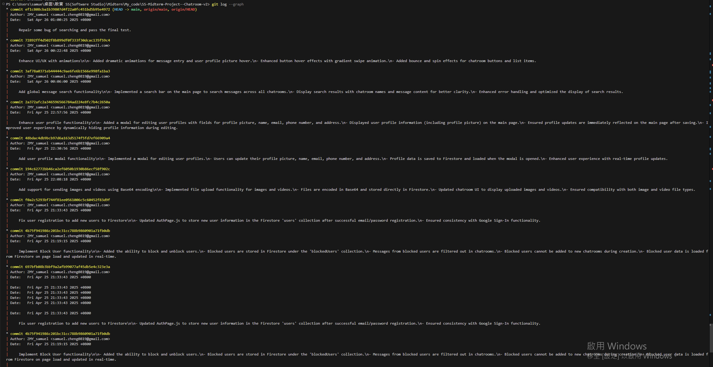
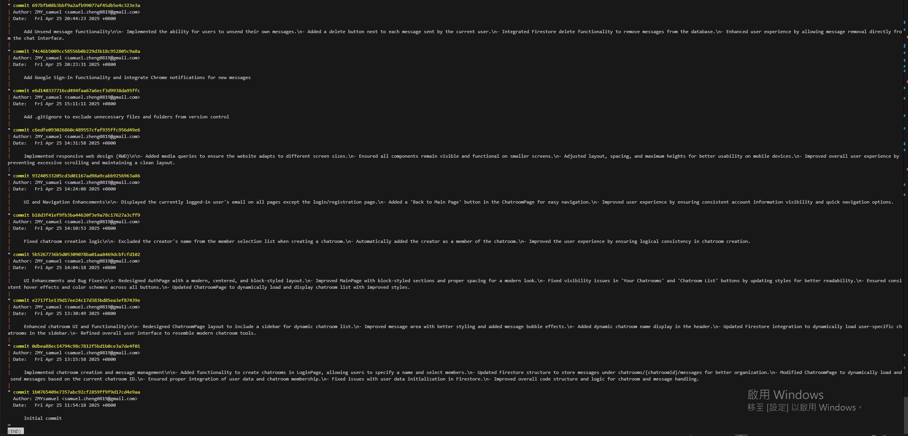
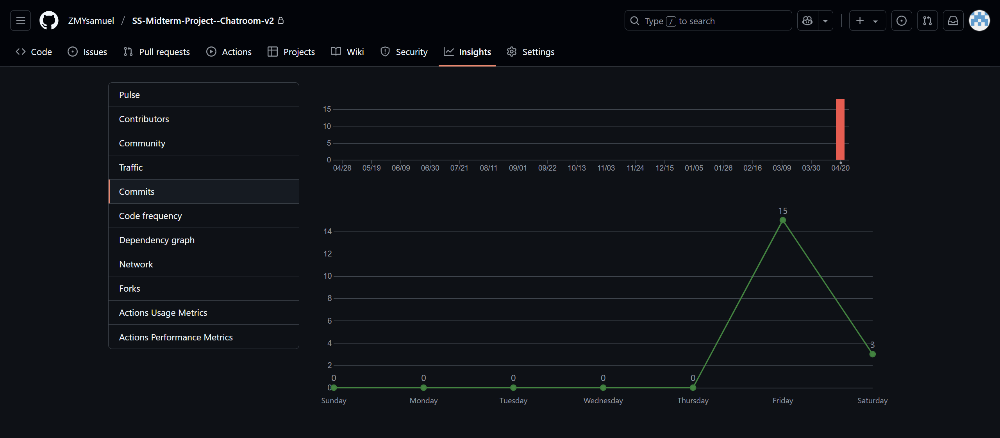

# SS-Midterm-Project--Chatroom-v2

## Overview
This project is a feature-rich chatroom application built using React and Firebase. It includes functionalities such as user authentication, private chatrooms, multimedia messaging, user profiles, and advanced search capabilities. The application is hosted on Firebase Hosting and supports responsive design for various device sizes.

---

## Features

### Membership Mechanism
- **Email Sign Up**: Users can register using their email and password.
- **Email Sign In**: Registered users can log in using their email and password.

### Firebase Hosting
- The application is hosted on Firebase Hosting.

### Database Read/Write
- All user data, chatroom data, and messages are securely stored in Firebase Firestore.
- Data is read and written in an authenticated manner to ensure security.

### Responsive Web Design (RWD)
- The website is fully responsive and works seamlessly on devices of all sizes.
- All components remain visible, and the layout adjusts dynamically to fit smaller screens.

### Git Version Control
- The project uses Git for version control with regular commits.
- The repository link and commit history are provided below.



<!--  -->

    The screenshots of the Git log and Git commit history.
[GitHub Repository Link](https://github.com/ZMYsamuel/SS-Midterm-Project--Chatroom-v2)

### Chatroom
- **Private Chatrooms**: Users can create private chatrooms to chat with other registered members.
- **Group Chat**: Chatrooms support group conversations, not one-on-one chats.
- **Message History**: All chat history is loaded when entering a chatroom.
- **Privacy**: Chatrooms are private and accessible only to members.

### React
- The entire application is built using React.

### Third-Party Authentication
- Users can sign up or log in using Google accounts.

### Chrome Notifications
- Notifications are sent for new messages when using Chrome.

### CSS Animation
- The application includes animations for:
  - Message entry.
  - User profile picture hover effects.

### Security
- Input sanitization is implemented to prevent XSS attacks.

### Bonus Components
- **User Profile**: Users can edit and save their profile information, including:
  - Profile picture
  - User name
  - Email
  - Phone number
  - Address
- **Profile Picture**: Users can upload and display a profile picture.
- **Send Image**: Users can send images in chatrooms.
- **Send Video**: Users can send videos in chatrooms.
- **Block User**: Users can block other members to stop receiving their messages and connot add them as chatroom member when creat a new chatroom.
- **Unsend Message**: Users can delete their own messages.
- **Search for Message**: Users can search for messages using prefix matching.

---

## How to Operate

### Sign Up and Sign In
1. Open the application.
2. Register using your email and password.
3. Log in with your registered credentials.

### Create a Chatroom
1. Navigate to the "Create Chatroom" section.
2. Enter a chatroom name and select members.
3. Click "Create Chatroom" to start chatting.

### Send Messages
1. Enter a chatroom.
2. Type your message in the input box and click "Send."
3. You can also upload images or videos to share in the chatroom.

### Edit Profile
1. Click "Edit Profile" on the main page.
2. Update your profile picture, name, email, phone number, or address.
3. Click "Save" to save changes.

### Block Users
1. Go to the "Block Users" section.
2. Select users to block or unblock.

### Search Messages
1. Use the search bar on the main page.
2. Enter a keyword to search for messages in chatrooms you belong to.

### Unsend Messages
1. Hover over your message in a chatroom.
2. Click the "Unsend" button to delete the message.

---

## Local Setup Instructions

### Prerequisites
- Node.js installed on your system.
- Firebase CLI installed and configured.

### Steps
1. Clone the repository:
   ```bash
   git clone https://github.com/ZMYsamuel/SS-Midterm-Project--Chatroom-v2.git
   ```
2. Navigate to the project directory:
   ```bash
   cd SS-Midterm-Project--Chatroom-v2
   ```
3. Install dependencies:
   ```bash
   npm install
   ```
4. Set up Firebase:
   - Replace the Firebase configuration in `firebase.js` with your own Firebase project details.
   - Deploy Firestore rules and indexes:
     ```bash
     firebase deploy --only firestore:rules
     firebase deploy --only firestore:indexes
     ```
5. Start the development server:
   ```bash
   npm start
   ```
6. Open the application in your browser at `http://localhost:3000`.

---

## Hosting URL

The application is hosted at the following URL:  
[https://ss-midterm-project-chatroom-v2.web.app](https://ss-midterm-project-chatroom-v2.web.app)

---

